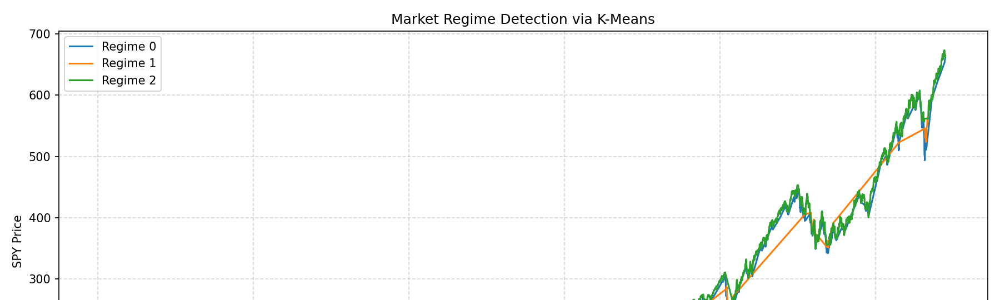

# Market Regime Detection 📊



A quantitative research project in Python that detects **market regimes** (bull / bear / neutral) using **K-Means clustering** on market and volatility data.

Built end-to-end: data ingestion, feature engineering, clustering, analysis, and visualizations.

---

## 🧠 Project Overview

This project analyzes historical market behavior to detect hidden states or "regimes" that exhibit distinct statistical properties — such as average returns, volatility, and VIX movement.

It uses:
- **SPY (S&P 500 ETF)** for market performance  
- **VIX (Volatility Index)** for market fear  
- **K-Means clustering** to segment the market into regimes

---

## 🧩 Project Structure
---

## ⚙️ Installation & Setup

Clone the repo and install dependencies:
```bash
git clone https://github.com/taylorjmellon/market-regime-detection.git
cd market-regime-detection
pip install -r requirements.txt

🚀 How to Run

Run the main model:

python3 src/regime_model.py


Or explore interactively:

jupyter notebook notebooks/01_quickstart.ipynb
📊 Results
Market Regimes Visualization

Shows SPY prices colored by detected market regimes:


Regime Statistics

Summarizes average returns and volatility by regime:


🧠 Key Insights

Regime 0 — Low volatility, positive returns → “Steady Bull”

Regime 1 — High volatility, negative returns → “Risk-Off / Bear”

Regime 2 — Moderate volatility, neutral returns → “Transition Phase”

These regimes show distinct statistical behavior that can be used for:

Portfolio weighting by regime

Volatility forecasting

Macro regime switching models

🧩 Technologies Used

Python

pandas, numpy, matplotlib

scikit-learn

yfinance

Jupyter Notebooks

📚 Next Steps

Add Hidden Markov Models (HMMs) for regime detection

Incorporate macro indicators (interest rates, yield curve)

Backtest strategy performance per regime

✍️ Author

Taylor Mellon
Quantitative Research | Data Science | Financial Modeling
📫 GitHub: @taylorjmellon